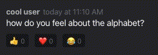

# Discord 2.0

Help! Through an unfortunate accident in our lab, we've lost all of the Discord code. We need your help to rebuild from scratch as quickly as possible!

The app and the backend are now written entirely in JavaScript, using React in the frontend and NodeJS for the backend. We've built an MVP with users, channels, and messages, but we need your help adding one of our favorite features — _message reactions_.

Please spend up to two hours implementing the frontend and backend for a message reaction feature. **Important** — when you're done, zip up this directory and submit it back to us. Please edit the last section of this README file with a short blurb telling us what tradeoffs you made and how you might improve your solution if you had more time.

## Task details

- ✅ Users should be able to react to any message with any of the following emojis: 👍 ❤️ 😂 
- ✅ Users may react to a single message with more than one emoji, but only once per emoji — clicking on a reaction emoji should act like a toggle, so clicking on the same emoji twice should result in no reaction
- ✅ Each reaction should include the sum of users who reacted to the message with the given emoji (e.g. if five users reacted to a message with 👍, the UI should display `👍 5`)
- ✅ The reaction should indicate whether the current user has reacted with that emoji or not (through a different background color, or other means)
- ✅ Avoid introducing new, glaringly-obvious security vulnerabilities
- ✅ Architect your database changes assuming that this API will run in a distributed system with eventually-consistent databases — concurrent user reactions should be handled gracefully

## Example UI

## Running locally

- `yarn` — Installs dependencies
- `yarn start` — Starts the Webpack and Node servers
- `yarn client` — Starts the Webpack server
- `yarn server` — Starts the Node server

## Contract for /reactions.db
{
    "createdAt":1643773685930,
    "content":
        {"userData":
            {"messageId":"9T8w2nW6tAR2n38t",
            "username":"username-here",
            "userId":"unique-userid-here" 
            "channelId":"7xUQnmvwaWnxJTTg",
            "thumbUp":0,
            "redHeart":0,
            "faceWithTearsOfJoy":0}
        },
    "_id":"unique-id-generated-here"
}

## Tradeoffs and follow-ups
## Private Video Link if you Prefer Visual/Audio  
https://www.youtube.com/watch?v=YtSRnEAN80k  

-Emojis
    - don't hard code emojis, include aria-label
        - aria-label assists visually impaired users 
            - isn't this required to be ADA compliant, legally? 
        - hard code create es linter errors 
     - make reusable (use one component to re-use for the 3 emojis we assigned, re-usable component)
-Database / handling Data queries
    - use a different database than NEDB? 
        - from my understanding, this db is appending all records to one file regardless of update/delete/post
        - this made it a bit difficult to query the proper data as I had to access the latest file unique to each User, where as something like Postgresql would have been a simple "SELECT * from reactions.db where UserId = 1" 
        - in terms of handling the data, I had to reformat it multiple times to get it the way I wanted it 
-How reactions were being fetched 
    - Ideally on the load up of MessageViwer.jsx, {useReactionStore} should have data from reactions.db stored and ready already. 
    - For some reason the records weren't showing up in {useReactionStore} so I had to put it in a useEffect(()), [] 
    - I don't prefer to tie certain interactions in useEffects that don't have to be
        - if the data was ready and accessible, it could have been stored in a different function outside of useEffect 
-Switch Case 
    - I decided to go w/ a switch case scenario based on the props.label of the emoji 
    - It just felt and looked a little cleaner 
    - The other option would be to create a different onClick for each emoji being clicked, but that's more code for the same functionality
-Handling Async 
    - If you do a CMD + F for "QUESTION 1" in the project you'll see the code where I had to some how create it a process where the functions would only be called once data is all ready 
    - I'm not sure if this is the optimal way to do this, but this is 1 way that I found so I wouldn't be sending half ready data due to async behaviors 
-Using CLSX 
    - compared to regular CSS i was able to dynamically assign classes to specific elements based on logic
    - this helped with assigning CSS to when a user reacted or un reacted to an emoji
-Database design 
    - It looks like the database was split up into 
    1) Channels 
    2) Messages 
    3) Users 
    - so I followed this and created one for Reactions 
    - - - - - - - - - - - - - -- - - - - - - - - - - - -
    - I would have preferred to have relational databases of some sort with the following design where I can query for all data or specific data
-Further Improvements
    - If I had more time I would:
    - certainly add Jest tests, typically test driven behavior is encouraged more, but with sensitive time restrictions I decided not to implement any. 
    - Find a way to render only reactions for a specific message, with my testing at the very end I saw that the reactions existed for all messages. Reactions should only exist for messages that the user(s) reacted to, not all messages
    - It would have been fun to see if I can copy the "reply" method of how Discord does it into this app
    - It would have also been fun to see how I would have implemented deleting channels and messages with the existing database structure and design this repo already has. 
    - I tested the app in Google chrome, incognito google chrome, and tried different web browsers with Safari developer mode. 
        - allReactions data returned from reactions.db would cause errors for the following: 
        - Google Chrome incognito would render an error initially but with a refresh it disappeared. 
        - Same with other browsers (Firefox, Edge)
        - Safari would just error out over all and a refresh wouldn't fix. 
        - If I had more time I would like to find the bug to that solution, why it works in browser perfectly fine and not the others. 
   "# test" 
